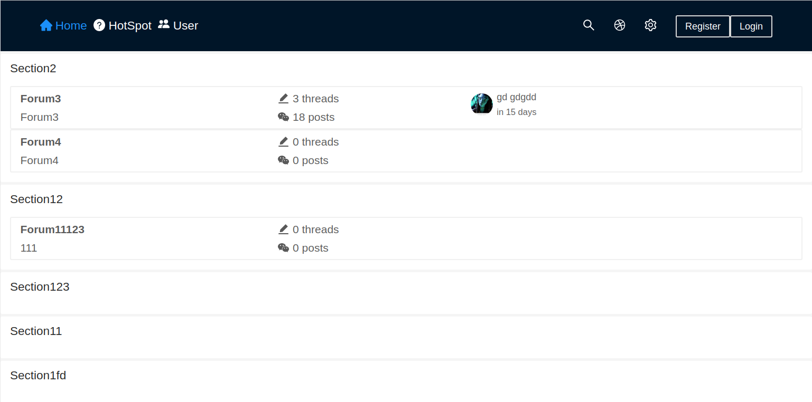
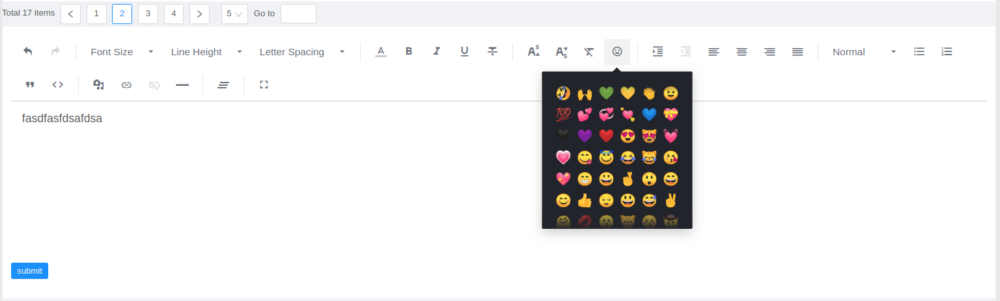
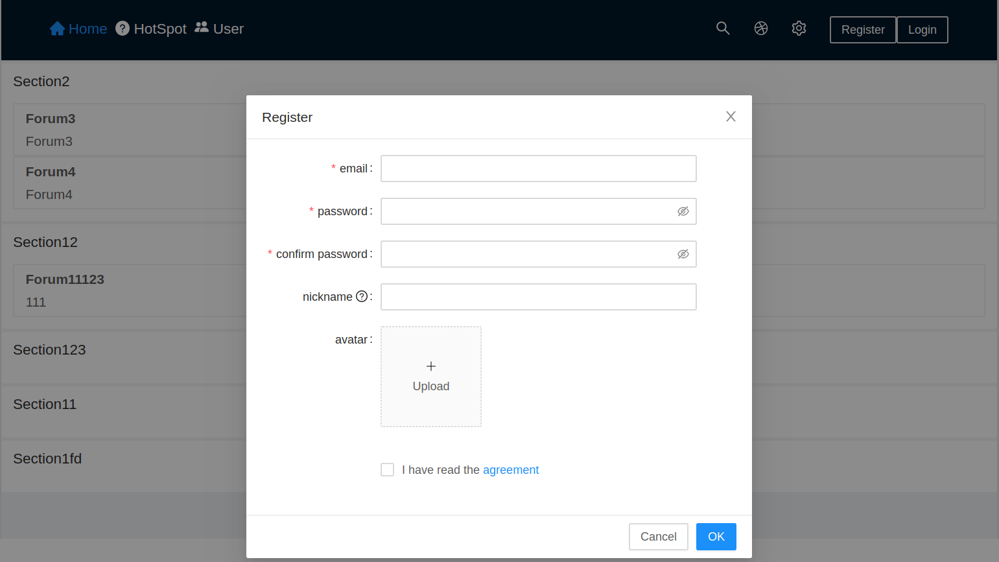
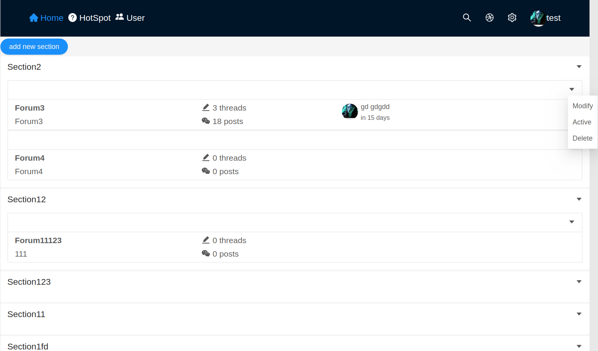
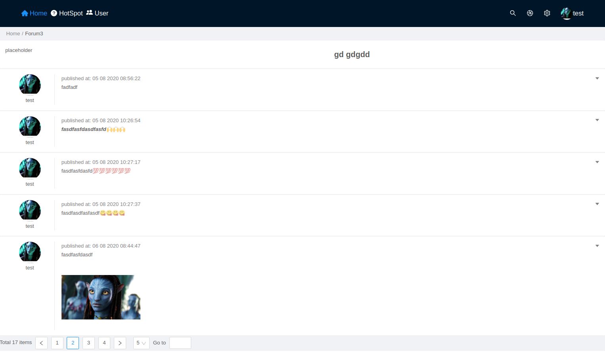
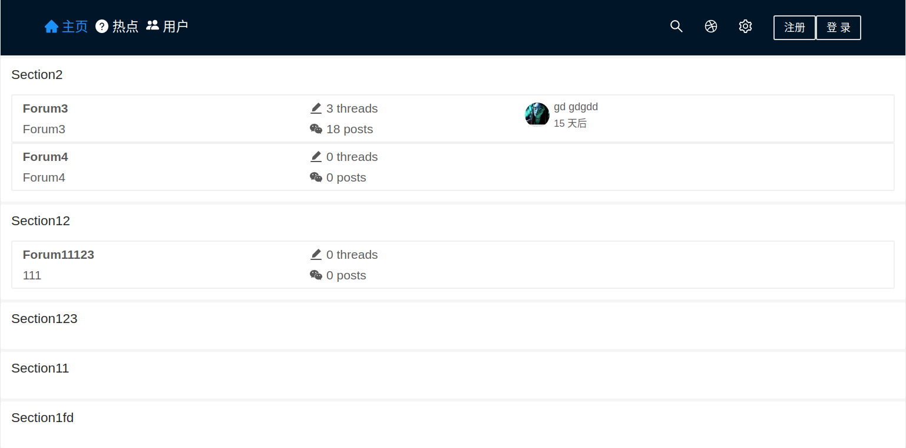

# qforum
Single-page forum application built in ReactJS and Django. The application is used to practice various technologies, such as duo token authentication, apollo client, antd, umijs and so on.

## Authentication
* duo token

## API protocol:
* Apollo client
* Ariadne

## Frontend
 * [React v16]
 * [Apollo v3]
 * [antd v3]
 * [umijs v3]
 * [etc](https://github.com/zhqingit/qforum/FRONTEND/package.json)


## Backend
 * [Django v3.0]
 * [ariadne v0.11]
 * [etc](https://github.com/zhqingit/qforum/requirements.txt)


## Demo Screenshots








## Installation

Make sure you have following software installed in your system:
* Python 3
* Node.js
* NPM / Yarn
* Git

First, we need to clone the repository
```
git clone https://github.com/zhqingit/qforum.git
```

Install all required dependencies in an isolated environment

```
cd qforum/
pip install -r requirements.txt
```

Install all required dependencies for frontend in qforum/FRONTEND folder by typing
```
cd ../FRONTEND
yarn
```

## Running Backend on Local Server


Then run the server, api endpoint should be available on http://localhost:8000/graphql

```
python manage.py runserver
```

## Running Frontend on Local Server

Start development server

```
cd FRONTEND
yarn start
```

Frontend should be available on http://localhost:8001/

### supper User
#### account: test@123.com, pass: 123;
